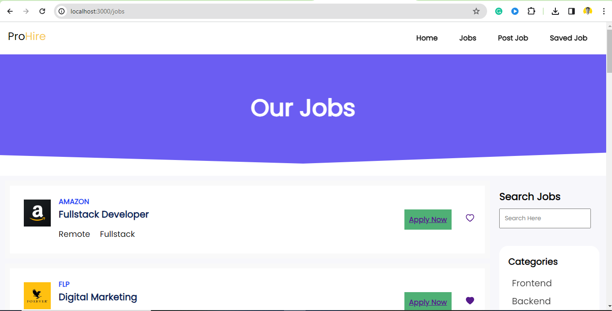
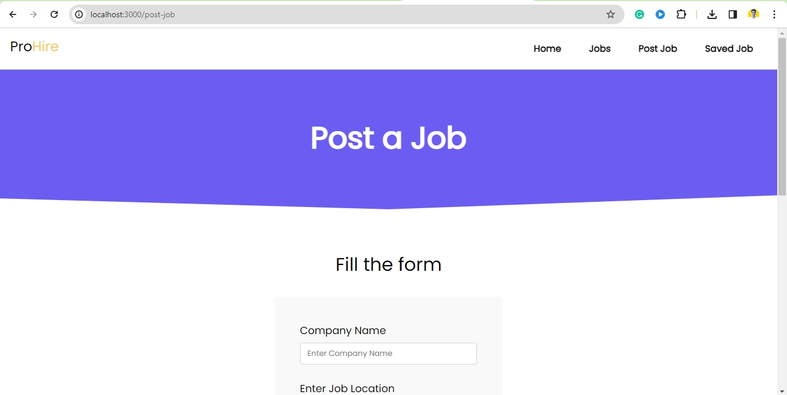

**ProHire: Your Global Career Connection**

ProHire is an advanced online job portal that curates top-notch job opportunities from leading global companies. Seamlessly search and filter jobs based on specific roles or experience levels, ensuring tailored job recommendations.

Companies seeking to feature their openings can effortlessly add job postings using a dedicated form on our platform. Additionally, users can bookmark their favorite jobs for easy access and tracking.

Introducing the Discussion Chamber, powered by Sanity (Headless CMS), where users engage in dynamic conversations. Our text editor provides formatting options like bold, italics, and more, while the image upload feature automatically previews images from pasted URLs via regex. Users can engage with text or images, fostering interactive discussions.

ProHire boasts full responsiveness, ensuring a smooth experience across all devices, empowering users to explore, apply, and engage effortlessly.

# Screenshots

## Home

## Jobs

## Post a Job

## Saved Jobs

# Tools and Technology Used:-

1.HTML CSS AND JS
2.React JS
3.Sanity for Backend.
4.VS Code
5.Vercel for deployment.
